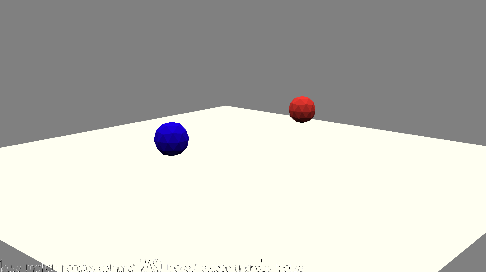

# Phase Dance

Author: George Whitfield

Design: Synchronize the phases of two sounds to unlock the path to escape!

Screen Shot:

NOTE: **THERE IS NO GAME. I am using my 1 'small game freebee' on this assignment.**

How To Play:

Controls: WASD

The player must listen to the sounds while moving throughout the scene. The 
sounds will change BPM as you move throughout the scene. Once the sounds are 
playing at the same BPM, the next level will unlock.

This game was built with [NEST](NEST.md).

